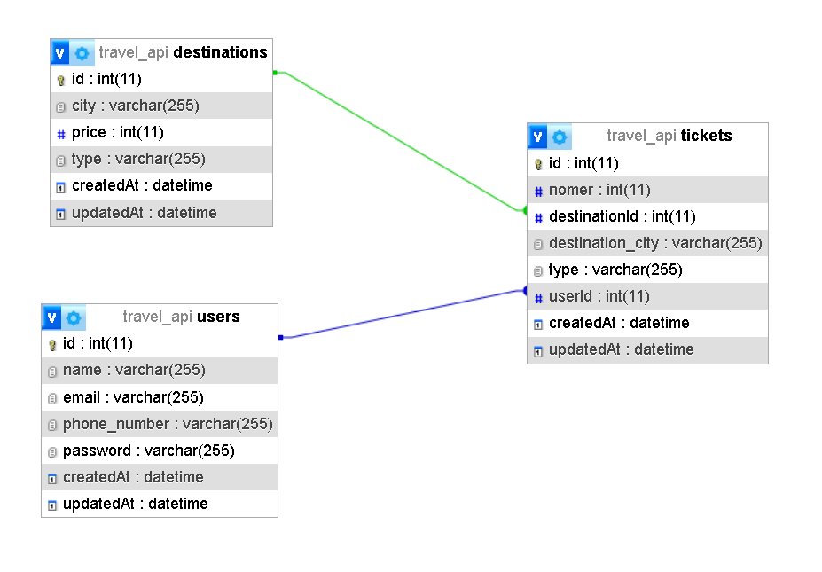

# Travel-API

## User Registration

**Endpoint:** `/api/auth/signup`

**Method:** `POST`

**Body:**
- `nama`: Nama pengguna (string)
- `email`: Alamat email pengguna (string)
- `phone_number`: Nomor telepon pengguna (string)
- `password`: Kata sandi pengguna (string)

**Header:** None

## User Login

**Endpoint:** `/api/auth/signin`

**Method:** `POST`

**Body:**
- `email`: Alamat email pengguna (string)
- `password`: Kata sandi pengguna (string)

**Header:** None

## Get Destination List

**Endpoint:** `/api/users/destination/list`

**Method:** `GET`

**Body:** None

**Header:**
- `Authorization`: JWT token

## Order Ticket

**Endpoint:** `/api/users/ticket/order`

**Method:** `POST`

**Body:**
- `destination`: Tujuan destinasi (string)

**Header:**
- `Authorization`: JWT token

## Get Ticket List

**Endpoint:** `/api/users/myticket`

**Method:** `GET`

**Body:**
- `nama`: Nama pengguna (string)

**Header:**
- `Authorization`: JWT token

## MODEL

